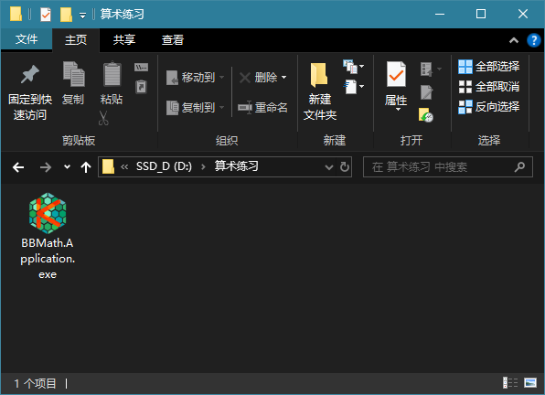
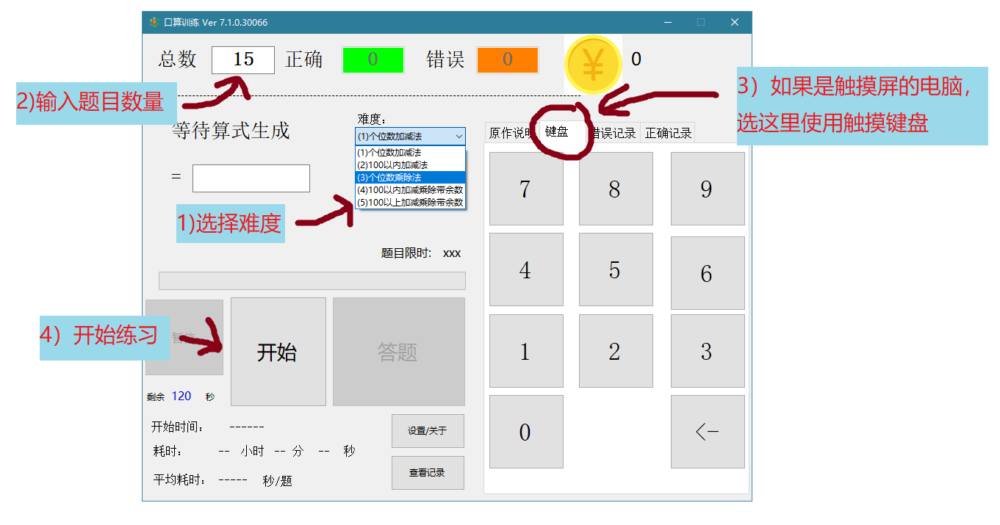
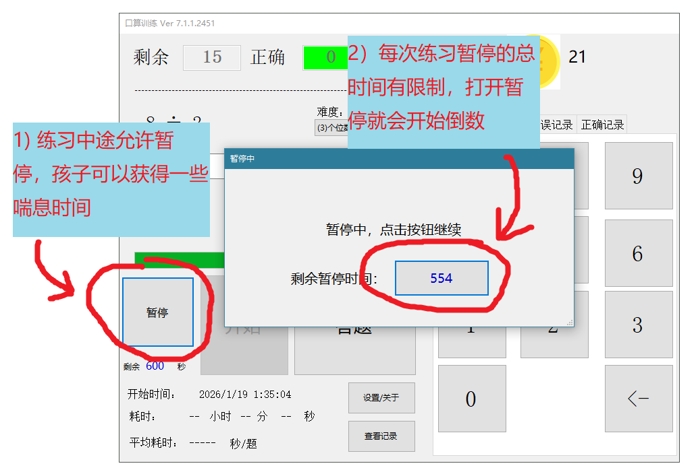
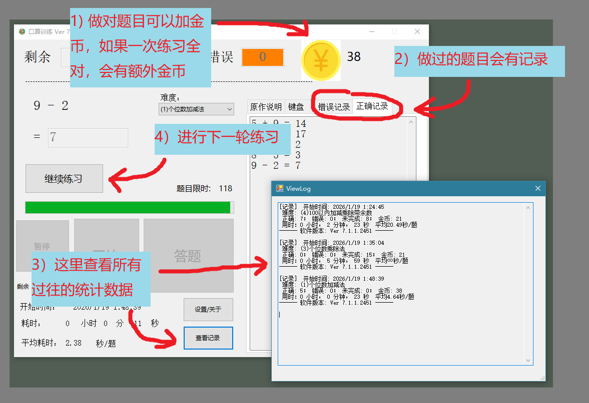
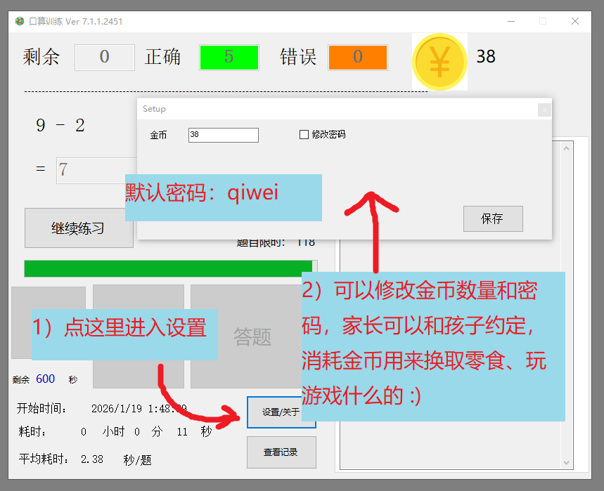

# 软件使用说明

## 简要介绍

BB Math 是一款面向儿童的算术练习软件，支持加法、减法、乘法、除法等多种题型，提供难度选择、金币奖励、答错/超时惩罚机制等功能，帮助孩子在趣味中提高数学能力。

## 主要功能

- ✅ **5种题型**：加法、减法、乘法、无余数除法、有余数除法
- ✅ **5个难度级别**：从个位数加减（LV1）到三位数加减乘除(有/无余数)运算（LV5）
- ✅ **奖励/惩罚 系统**：答对奖励金币，全对额外奖励；答错或单题超时会增加题目
- ✅ **暂停机制**：支持限时间暂停，可以让孩子自己把握一次练习的时间分配
- ✅ **金币系统**：金币奖励自动记录，家长可以手动增加或扣除，可以用于和孩子的约定，例如扣除多少金币换取零食等。
- ✅ **练习历史记录**：记录练习统计数据，方便家长回顾

## 安装说明

### 系统要求

- 操作系统：Windows 7 及以上版本
- .NET Framework：4.6.2 或更高版本

### 下载使用

1. 项目发布页面：https://github.com/ngbruce/BB_Math/releases
2. 国内建议访问此地址，不需要魔法：https://gitee.com/bruceng/bb_math/releases   
3. 下载最新版本的压缩包（.zip 文件）
4. 解压文件到非系统目录（如 `D:\算术练习\`）
   


4. 双击 `BB_Math.Application.exe` 运行程序

**注意**：
- 程序为绿色软件，无需安装，解压即用，不需要管理员权限即可运行
- 应该在Windows系统给孩子建立一个普通账户，不要解压到C盘，否则孩子可能没有读写权限。
- 这是一个开源软件，其他人员可能会克隆以及修改本程序，原作者一改不负责。
- 原作者 github 仓库地址 https://github.com/ngbruce/BB_Math
- 原作者 gitee 仓库地址(定期从github更新，方便国内用户访问) https://gitee.com/bruceng/bb_math

## 快速上手

### 首次使用


### 主界面
程序启动后的主界面，可以设置题目数量、难度级别，查看当前金币数量。



### 暂停功能
答题界面，可以有限时间暂停。



### 结果展示
练习完成后显示成绩统计、获得金币、错题回顾。



### 设置功能
家长可以设置密码、调整金币。




### 金币使用

答对题目可获得金币奖励，用于激励孩子坚持练习。

**获取金币**：
- 答对一题：+3 金币（可配置）
- 全部答对：额外奖励（初始题数 × 0.5）

## 难度级别选择

根据孩子的年龄和数学水平选择合适的难度：

| 级别 | 题型范围 | 操作数范围 | 适用对象 |
|------|---------|-----------|---------|
| LV1 | 加法、减法 | 1-9 | 小学一年级 |
| LV2 | 加法、减法 | 1-99 | 小学低年级 |
| LV3 | 乘法、除法 | 1-9 | 小学中年级 |
| LV4 | 加、减、乘、除 | 1-99 | 小学中高年级 |
| LV5 | 加、减、乘、除 | 1-999 | 小学高年级 |

**建议**：
- 初学者从 LV1 开始
- 掌握后逐步提升难度
- 可以根据学校进度选择对应级别


**默认密码**：`qiwei`（可在设置中修改）

## 常见问题

### 程序无法启动

**原因**：.NET Framework 未安装或版本过低

**解决方法**：
1. 访问 [Microsoft .NET Framework 下载页面](https://dotnet.microsoft.com/download/dotnet-framework)
2. 下载并安装 .NET Framework 4.6.2 或更高版本
3. 重启电脑后再次尝试启动

### 无法查看历史记录

**原因**：历史记录文件损坏或丢失

**解决方法**：
- 检查程序目录下是否有 `bbmath.dat` 文件
- 如果文件丢失，历史记录将无法恢复
- 建议定期备份 `bbmath.dat` 文件

### 向开发者反映程序bug

**日志位置**：
- 日志文件存储在程序目录下的 `log` 子目录中
- 文件命名格式：`bbmath_YYYY-MM-DD.log`（如 `bbmath_2026-01-17.log`）
- 如果遇到问题，可以将日志文件发给开发者分析

## 数据备份

酌情对数据进行备份或清理：

- `bbmath.cfg` - 配置文件（包含金币、密码、设置等）
- `bbmath.dat` - 练习历史记录
- `log/` 目录 - 如果没有遇到问题，此目录以及里面的文件可以定期删除，程序启动时会自动创建

**备份方法**：
1. 找到程序目录（解压后的文件夹）
2. 复制上述文件到备份位置（如外部硬盘或云存储）

## 卸载程序

由于程序为绿色软件，卸载非常简单：

1. **关闭程序**（如果正在运行）
2. **删除程序文件夹**
   - 找到解压的文件夹（如 `D:\Programs\BB_Math\`）
   - 直接删除整个文件夹即可

**注意事项**：
- 程序文件夹内的配置文件和历史记录会一起删除
- 如需保留数据，请在删除前备份以下文件：
  - `bbmath.cfg` - 配置文件
  - `bbmath.dat` - 练习历史记录
  - `log/` 目录 - 日志文件（用于分析bug）
- 不会在系统中留下注册表项或系统服务

## 获取帮助

- **文档**：查看本文档和软件内的帮助说明
- **问题反馈**：访问 [GitHub Issues](https://github.com/ngbruce/BB_Math/issues) 提交问题
- **联系作者**：通过 GitHub 项目页面、或应用程序里面显示的的社交媒体二维码联系


# 软件开发和授权说明 (主要供开发者阅读)

一款面向儿童的小学数学练习软件，支持加法、减法、乘法、除法等多种题型，提供难度选择、金币奖励机制等功能。

## 功能特性

- ✅ 5种题型：加法、减法、乘法、无余数除法、有余数除法
- ✅ 5个难度级别：LV1（个位数加减）到 LV5（三位数四则运算）
- ✅ 暂停机制：限次数暂停或限时间暂停
- ✅ 金币奖励系统：答对奖励、全对奖励
- ✅ 日志系统：完整记录练习历史
- ✅ 错误恢复：自动检测并修复配置文件损坏
- ✅ MVP 架构：界面与业务逻辑分离，易于维护和扩展
- ✅ OpenSpec 规范：使用 OpenSpec 管理功能变更和规范

## 技术栈

- **开发环境**: Visual Studio 2019
- **语言**: C# (.NET Framework)
- **架构**: Windows Forms + MVP 模式
- **测试框架**: MSTest
- **规范管理**: OpenSpec
- **日志系统**: 结构化日志（Debug/Info/Warning/Error）

## 快速开始

### 环境要求
- Visual Studio 2019 或更高版本
- Windows 操作系统
- .NET Framework 4.6.2 或更高版本

### 编译运行
1. 克隆仓库
   ```bash
   git clone https://github.com/ngbruce/BB_Math.git
   cd BB_Math
   ```
2. 用 Visual Studio 打开 `BB_Math.sln`
3. 按 F5 编译并运行

### 运行测试

**在 Visual Studio 2019 中运行**（推荐）：
1. 打开 `BB_Math.sln`
2. 点击菜单：**测试** → **测试资源管理器**
3. 点击 **运行全部** 按钮
4. 查看测试结果

### 详细的测试说明
查看 [测试说明](docs/TESTING.md) 了解更多关于测试的信息，包括测试分类、常见问题解答等。

## 文档

### 核心文档
- [开发规范](docs/CODING_STANDARDS.md) - 快速参考和核心约束
- [API 参考](docs/API_REFERENCE.md) - 类和接口详细定义
- [资源版权声明](Resources/README.txt) - 原作者商品展示资源的版权说明

### OpenSpec 规范
- [OpenSpec 使用指南](openspec/AGENTS.md) - 规范管理和提案流程
- [项目总体规范](openspec/project.md) - 技术栈和开发约定
- [功能规范目录](openspec/specs/) - 各功能模块详细规范（配置管理、金币系统、暂停机制等）

## 项目结构

```
BB_Math/
├── Core/              # 核心业务逻辑
│   ├── GameStateManager.cs      # 游戏状态管理
│   ├── ErrorRecoveryService.cs   # 错误恢复服务
│   ├── MathProblemGenerator.cs   # 数学题目生成器
│   ├── DifficultyConfiguration.cs # 难度配置
│   └── ...
├── UI/                # 界面层（MVP 模式）
│   ├── MainFormPresenter.cs      # 主界面 Presenter
│   └── ...
├── Configuration/     # 配置管理
│   ├── IniConfigurationService.cs # INI 配置服务
│   ├── AppSettings.cs           # 应用设置
│   └── ...
├── BBMath.Tests/      # 单元测试
│   ├── AppConstantsTests.cs
│   ├── ExceptionHandlingTests.cs
│   └── ...
├── openspec/          # 规范管理
│   ├── specs/         # 功能规范
│   ├── changes/       # 变更提案
│   ├── archive/       # 已归档的变更
│   ├── AGENTS.md      # OpenSpec 使用指南
│   └── project.md     # 项目总体规范
├── docs/              # 技术文档
│   ├── CODING_STANDARDS.md  # 开发规范快速参考
│   ├── API_REFERENCE.md     # API 接口参考
│   └── TESTING.md          # 测试说明
├── Properties/        # 项目属性
├── Resources/         # 资源文件（包含原作者商品展示资源）
│   ├── README.txt    # 资源版权声明
│   ├── ori_ProductMainPic.jpg
│   ├── ori_TaoBaoQCode.jpg
│   ├── ori_RedNoteAccount.jpg
│   ├── ori_TiktokChinaAccount.jpg
│   └── ori_WeChatQCode.jpg
└── Form1.cs          # 主窗体
```

## 测试覆盖

项目包含完整的单元测试，目前共有 219 个测试用例，全部通过。

### 测试分类
- 常量类测试（AppConstantsTests）
- 异常处理测试（ExceptionHandlingTests）
- 配置管理测试
- 数学运算测试
- 日志系统测试
- 文件服务测试

运行测试命令：
```bash
# 方法 1：在 Visual Studio 中运行（推荐）
# 打开 BB_Math.sln，然后：测试 → 测试资源管理器 → 运行全部

# 方法 2：使用命令行
# 先编译项目
msbuild BB_Math.sln /p:Configuration=Debug /t:Rebuild

# 运行所有测试
vstest.console.exe BBMath.Tests\bin\Debug\BBMath.Tests.dll

# 运行特定测试类
vstest.console.exe BBMath.Tests\bin\Debug\BBMath.Tests.dll /Tests:AppConstantsTests

# 运行测试并输出详细日志
vstest.console.exe BBMath.Tests\bin\Debug\BBMath.Tests.dll /Logger:trx;LogFileName=test-results.trx /Verbose
```

## 难度级别说明

| 级别 | 题型范围 | 操作数范围 | 适用对象 |
|------|---------|-----------|---------|
| LV1 | 加法、减法 | 1-9 | 小学一年级 |
| LV2 | 加法、减法 | 1-99 | 小学低年级 |
| LV3 | 乘法、除法 | 1-9 | 小学中年级 |
| LV4 | 加、减、乘、除 | 1-99 | 小学中高年级 |
| LV5 | 加、减、乘、除 | 1-999 | 小学高年级 |

## 配置说明

程序首次运行时会自动创建配置文件 `bbmath.cfg`，默认配置如下：

- 金币数：0
- 密码：qiwei
- 暂停类型：限时间（600秒，即10分钟）
- 习题总数：15
- 答对奖励：3 金币

配置文件格式为 INI，可手动编辑，但建议通过程序内的设置界面修改。

## 日志说明

程序会在运行目录下创建 `log` 子目录，并在其中创建以下日志相关文件：

- `log/bbmath_YYYYMMDD.log` - 运行日志（如果启用），按日期自动轮转
- `bbmath.cfg` - 配置文件（位于运行目录）
- `bbmath.dat` - 练习历史数据（位于运行目录）

日志特性：
- ✅ 自动创建 `log` 目录（如果不存在）
- ✅ 日志文件按日期命名（如 `bbmath_20260117.log`）
- ✅ 单个日志文件最大 10 MB，超过后自动轮转
- ✅ 支持多级别日志：Debug、Info、Warning、Error

## 开发指南

### 编码规范
- 命名空间：`BBMath.Application`、`BBMath.Core`、`BBMath.UI`、`BBMath.Configuration`
- 命名约定：PascalCase（类、方法）、camelCase（变量）
- 文档注释：所有公共类和方法必须包含 XML 注释

### OpenSpec 工作流
1. 阅读相关规范文档
2. 创建变更提案：`openspec/changes/[change-id]/`
3. 实现功能，更新 tasks.md
4. 运行测试确保通过
5. 归档变更：`openspec/archive/YYYY-MM-DD-[change-id]/`

详细流程请参考：[openspec/AGENTS.md](openspec/AGENTS.md)

### VS Code 环境约束
- ✅ **允许**：代码编写、文档维护、文件读写、文本搜索、规范管理
- ❌ **禁止**：编译、调试、运行 C# 工程
- ⚠️ **必须**：窗体设计、控件添加/修改在 Visual Studio 2019 中完成

## 已知问题

- 当前版本暂无已知问题

## 版本历史

### v7.1.0 (2026-01-17)
- 日志目录自动创建：日志文件存储在 `log` 子目录下，便于管理
- 初始化错误处理增强：每个初始化步骤失败时详细记录日志
- 窗体标题显示版本号：启动时自动显示当前版本
- 修复 Application.Exit() 在构造函数中不生效的问题
- 修复双重初始化日志的问题
- 优化日志文件路径管理

### v7.0.0 (2026-01-16)
- MVP 架构重构
- OpenSpec 规范管理体系
- 5个难度级别选择
- 题型分布平衡优化
- 完整的单元测试覆盖（219个测试）
- LV5 难度出题重试问题修复
- 测试日志打印答案功能
- 全对奖励金币系数优化

### v6.x.x
- 初始版本

## 贡献

欢迎贡献！请遵循以下步骤：

1. Fork 本仓库
2. 创建特性分支 (`git checkout -b feature/AmazingFeature`)
3. 使用 OpenSpec 流程创建变更提案（详见 [openspec/AGENTS.md](openspec/AGENTS.md)）
4. 提交更改 (`git commit -m 'Add some AmazingFeature'`)
5. 推送到分支 (`git push origin feature/AmazingFeature`)
6. 开启 Pull Request

## 许可证

本项目采用 **BB Math Custom Public License v1.0**（基于 Mozilla Public License 2.0 并附加额外限制）。

### 许可证条款概要

**授予的权利**（基于 MPL 2.0）：
- ✅ 免费使用软件（非商业用途）
- ✅ 查看和修改源代码
- ✅ 分发软件（非商业用途）

**额外限制**（BB Math Custom License）：
- ❌ **禁止商业使用**：不得出售、用于商业产品或收费服务
- ❌ **禁止删除广告**：不得移除或修改"原作说明"页面的商品展示内容
- ❌ **商业衍生作品**：如需商业使用，必须获得原作者的授权

**说明**：
- 原作者通过展示商品获得收入，以持续开发和维护软件
- 许可证约束的是使用者，而非原作者

完整的许可证条款请参见：[LICENSE](LICENSE)

### 关于原作者商品展示资源

本软件在"原作说明"标签页（tpAbout）中展示了原作者的商品和社交媒体信息，包括：

- **商品主图**：智能坐姿提醒器产品展示
- **购买链接**：淘宝商品二维码
- **社交媒体**：微信、抖音、小红书账号二维码

**保护措施**：
- 这些资源在编译阶段嵌入为资源文件，非联网内容
- 通过 Windows Forms 设计器静态绑定
- 不得删除、隐藏或替换（许可证强制要求）

详细说明请参见：[Resources/README.txt](Resources/README.txt)

---

## 贡献指南

欢迎贡献！我们接受以下形式的贡献：

- 🐛 报告 Bug
- 💡 提出新功能
- 📝 改进文档
- 🔧 修复代码问题
- ✅ 添加测试用例

### 开发流程

1. **Fork 本仓库并克隆**
   ```bash
   git clone https://github.com/ngbruce/BB_Math.git
   cd BB_Math
   ```

2. **创建特性分支**
   ```bash
   git checkout -b feature/your-feature-name
   # 或
   git checkout -b fix/your-bug-fix
   ```

3. **阅读规范文档**
   - [开发规范](docs/CODING_STANDARDS.md)
   - [OpenSpec 使用指南](openspec/AGENTS.md)
   - 相关功能规范（`openspec/specs/`）

4. **创建 OpenSpec 提案**（如需要）
   - 新功能或重大变更必须创建提案
   - 按照 `openspec/AGENTS.md` 的流程操作

5. **编写代码并测试**
   - 在 Visual Studio 中运行测试（测试 → 测试资源管理器 → 运行全部）
   - 所有测试必须通过

6. **提交代码**
   ```bash
   git add .
   git commit -m "feat: 添加新功能描述"
   # 或
   git commit -m "fix: 修复问题描述"
   ```

   提交消息格式：
   - `feat:` 新功能
   - `fix:` Bug 修复
   - `docs:` 文档更新
   - `style:` 代码格式调整
   - `refactor:` 重构
   - `test:` 添加或修改测试
   - `chore:` 构建过程变动

7. **推送并创建 Pull Request**
   ```bash
   git push origin feature/your-feature-name
   ```
   - 访问 GitHub 页面创建 Pull Request
   - 等待代码审查

### 编码规范

- **命名约定**：PascalCase（类、方法）、camelCase（变量）、_camelCase（私有字段）
- **文档注释**：所有公共类和方法必须包含 XML 注释
- **测试要求**：新功能必须包含单元测试，Bug 修复应添加回归测试

### VS Code 环境约束

**允许**：代码编写、文档维护、文件读写、文本搜索、规范管理

**禁止**：编译、调试、运行 C# 工程，修改 `*.Designer.cs` 文件

**必须在 Visual Studio 2019 中完成**：编译、调试、运行，窗体设计、控件添加/修改

---

## 行为准则

### 社区标准

我们承诺营造开放和友好的环境，欢迎所有形式的贡献。

**积极行为**：
- 使用欢迎和包容的语言
- 尊重不同的观点和经验
- 优雅地接受建设性的批评
- 关注对社区最有利的事情

**不可接受的行为**：
- 恶意攻击或侮辱性言论
- 公开或私下骚扰
- 未经同意发布他人的私人信息
- 其他不道德或不专业的行为

### 执行

项目维护者有权删除、编辑或拒绝不符合本行为准则的内容，并暂时或永久禁止任何行为不当的贡献者。

---

## 支持与安全

### 获取帮助

在提问前，请先搜索现有的 [Issues](https://github.com/ngbruce/BB_Math/issues) 和文档。

### 支持渠道

- **GitHub Issues**：Bug 报告、功能请求、问题讨论
- **文档**：[README](README.md)、[开发规范](docs/CODING_STANDARDS.md)、[API 参考](docs/API_REFERENCE.md)

### 常见问题

| 问题 | 可能原因 | 解决方案 |
|------|----------|----------|
| 程序无法启动 | .NET Framework 未安装 | 安装 .NET Framework 4.6.2 或更高版本 |
| 程序无法启动 | 配置文件损坏 | 删除 `bbmath.cfg` 文件，让程序重新生成 |
| 日志系统不工作 | `log` 目录无写权限 | 检查程序目录的写权限 |
| 题目生成不符合难度 | 配置文件错误 | 通过程序内设置界面修改难度 |

### 日志收集

提交 Bug 报告时，请包含日志信息（`log/bbmath_YYYYMMDD.log`）。

### 安全漏洞报告

**请勿在公开 Issues 中报告安全漏洞**，请通过 GitHub Issues 私下联系项目维护者。

**请提供**：
1. 漏洞类型（例如：XSS、权限绕过等）
2. 受影响的版本
3. 复现步骤
4. 潜在影响

我们会在 48 小时内确认收到，并在 7 天内提供评估和修复时间表。

---

## 致谢

- 感谢所有参与测试和反馈的用户
- 感谢开源社区的支持

## 联系方式

- 作者：ngbruce
- 项目地址：https://github.com/ngbruce/BB_Math
- 问题反馈：https://github.com/ngbruce/BB_Math/issues

---
